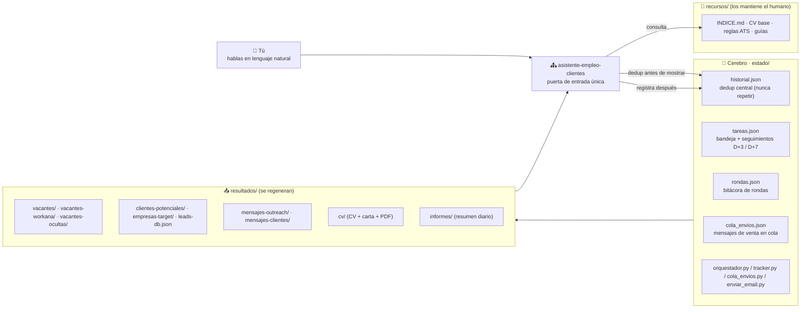
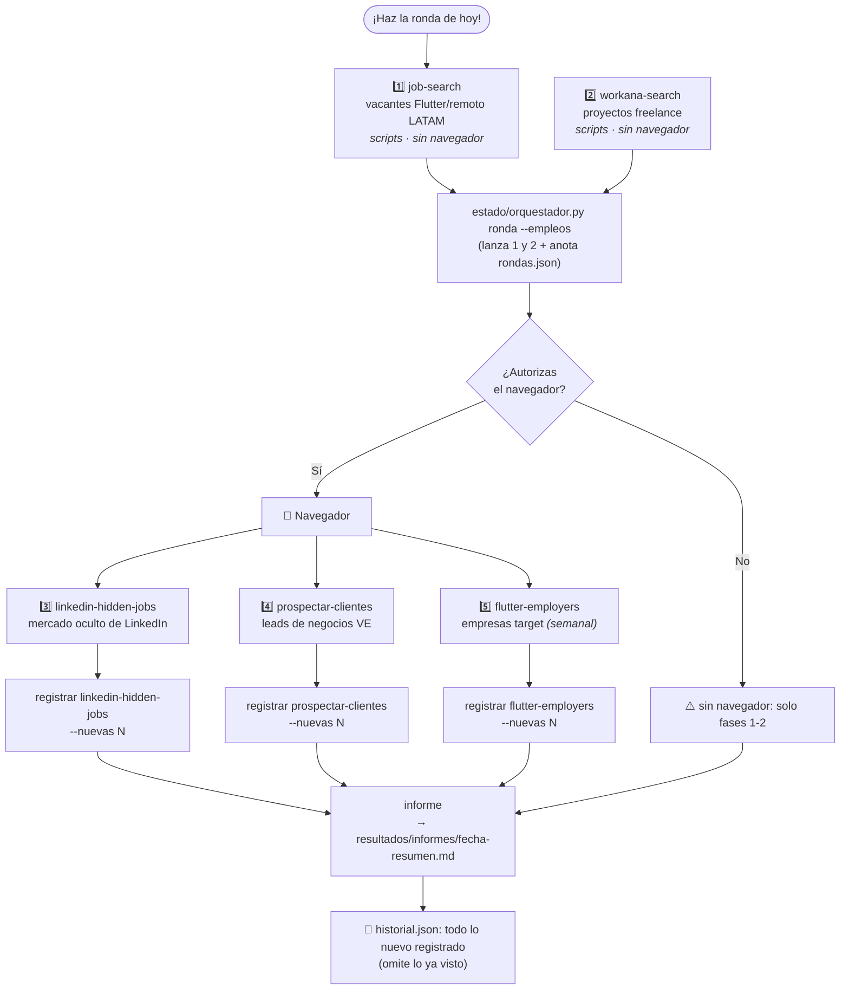
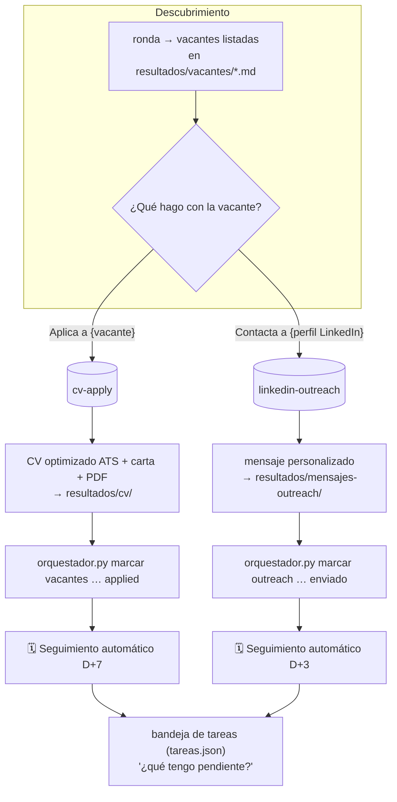
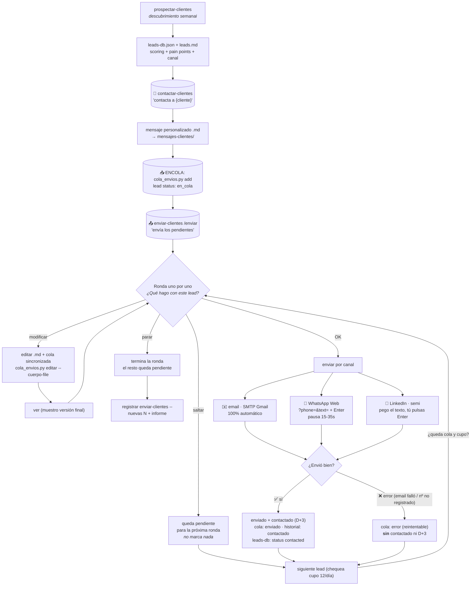
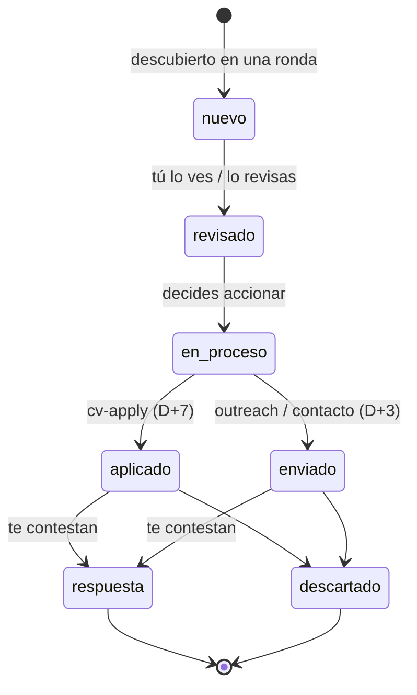
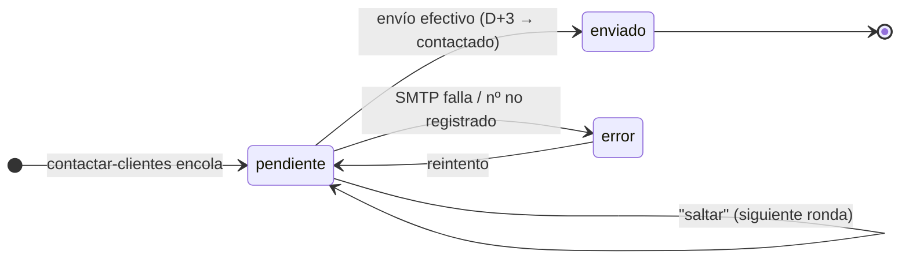
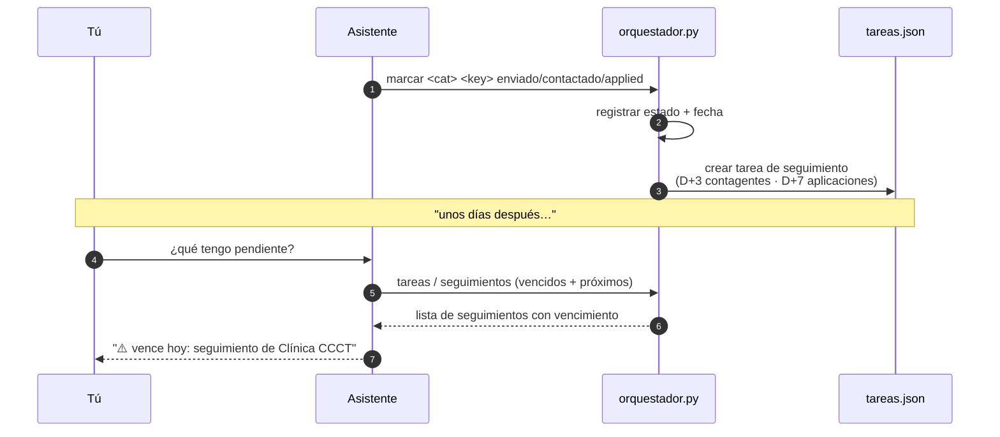

# Diagramas — Asistente IDUCDEV (Flujos completos)

Diagramas en **Mermaid** ([ver en GitHub](https://github.com) o copiar cada
bloque en https://mermaid.live para editarlos). Vista renderizada:
`docs/diagramas.html` (ábrelo en el navegador).

---

## 0. Arquitectura general

---

## 1. "Haz la ronda de hoy" — Descubrimiento (empleos + clientes)

---

## 2. Empleo — de la vacante a la aplicación/contacto

---

## 3. Clientes — prospectar → generar → enviar (uno por uno)

---

## 4. Ciclo de vida del estado (historial.json) y de la cola

---

## 5. Seguimientos automáticos (bandeja D+3 / D+7)

---

**Reglas que aplican a todos los diagramas:**

1. **Nunca repetir:** historial dedup en toda skill (consultar + registrar).
2. Resultados **siempre** en `resultados/<skill>/`, nunca en `recursos/`.
3. Navegador **solo con autorización** explícita.
4. Clientes: `contactado`/D+3 solo tras **envío efectivo** (errores reintentables).
5. Límite 12 envíos/día, pausa 15-35s entre WhatsApp.